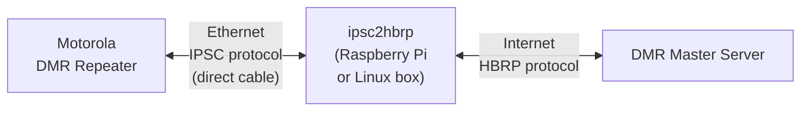

# ipsc2hbrp

[](https://github.com/USA-RedDragon/ipsc2hbrp/actions/workflows/release.yaml) [](https://github.com/USA-RedDragon/ipsc2hbrp) [](https://goreportcard.com/report/github.com/USA-RedDragon/ipsc2hbrp) [](https://github.com/USA-RedDragon/ipsc2hbrp/blob/main/LICENSE) [](https://github.com/USA-RedDragon/ipsc2hbrp/releases/) [](https://codecov.io/gh/USA-RedDragon/ipsc2hbrp)

**Connect your Motorola IPSC repeater to BrandMeister.**

ipsc2hbrp is a protocol bridge that translates between Motorola's IP Site Connect (IPSC) protocol and the Homebrew Repeater Protocol (HBRP). This lets your IPSC-only repeater talk to a DMR master such as BrandMeister.

## How It Works



Your repeater connects directly via Ethernet cable to the box running ipsc2hbrp. The software acts as an IPSC master to the repeater and forwards voice and data traffic to and from a DMR master such as BrandMeister over the internet.

## Requirements

- A **Motorola IPSC-capable DMR repeater**
- A **Raspberry Pi** (any model with Wi-Fi and an Ethernet port) or any **Linux box with a spare NIC**
- An **Ethernet cable** to connect the repeater directly to the Pi/Linux box
- **Internet access** on the Pi/Linux box (via Wi-Fi on a Raspberry Pi, or a second NIC on a Linux box)
- A **DMR Master** with a registered repeater ID to connect to (e.g. BrandMeister)

## Setup

### 1. Download ipsc2hbrp

Download the latest binary for your platform from the [GitHub Releases](https://github.com/USA-RedDragon/ipsc2hbrp/releases/) page. For a Raspberry Pi, grab the `linux-arm64` build, for desktop Linux use `linux-amd64`. Make it executable and move it to your PATH:

```bash
# Example for Raspberry Pi (arm64):
wget https://github.com/USA-RedDragon/ipsc2hbrp/releases/latest/download/ipsc2hbrp-linux-arm64
chmod +x ipsc2hbrp-linux-arm64
sudo mv ipsc2hbrp-linux-arm64 /usr/local/bin/ipsc2hbrp
```

### 2. Create the Config File

Copy the example config and edit it:

```bash
sudo wget -O /etc/ipsc2hbrp.yaml https://raw.githubusercontent.com/USA-RedDragon/ipsc2hbrp/main/config.example.yaml
sudo nano /etc/ipsc2hbrp.yaml
```

Here is the full example config with comments:

```yaml
log-level: info

ipsc:
  interface: "eth0"       # The network interface connected to your repeater
  port: 50000             # UDP port the repeater will connect to
  ip: "10.10.250.1"       # IP address assigned to the interface (must match repeater's Gateway IP)
  subnet-mask: 24         # Subnet mask (24 = 255.255.255.0)
  auth:
    enabled: false        # Set to true if you configured an auth key in CPS
    key: ""               # Hex string, up to 40 characters (must match CPS)

hbrp:
  master-server: "3104.master.brandmeister.network:62030"  # BrandMeister master (see below)
  password: "passw0rd"    # Your BrandMeister hotspot password

  callsign: N0CALL        # Your callsign
  radio-id: 123456789     # Your registered repeater DMR ID

  # Frequencies in Hz:
  rx-freq: 429075000
  tx-freq: 424075000

  color-code: 7           # Must match your repeater's color code (0-15)

  # Optional, reported to BrandMeister:
  # latitude: 30.000000
  # longitude: -97.000000
  height: 3               # Antenna height in meters
  location: "My City, ST"
  # description: ""
  # url: ""
```

**Config notes:**

- **`ipsc.interface`** - The name of the network interface physically connected to your repeater. On a Raspberry Pi this is typically `eth0`. Run `ip link` to see your interface names.
- **`ipsc.ip`** - The IP address ipsc2hbrp assigns to that interface. This becomes the "Master IP" in your repeater's CPS config, and also the gateway for the repeater. Pick any private IP (e.g. `10.10.250.1`).
- **`ipsc.port`** - The UDP port to listen on. The default `50000` works fine. Must match the "Master UDP Port" in CPS.
- **`hbrp.master-server`** - Your DMR master's host and port. For BrandMeister, find the master covering your region in the [BrandMeister Master Server List](https://brandmeister.network/?page=masters). The format is `host:port` (e.g. `3104.master.brandmeister.network:62030`).
- **`hbrp.password`** - Your BrandMeister hotspot security password, such as the one set in your BrandMeister self-care dashboard.
- **`hbrp.radio-id`** - Your repeater's DMR ID, registered at [radioid.net](https://radioid.net/).

### 3. Configure the Motorola Repeater (CPS)

Open your repeater's codeplug in the **Motorola Customer Programming Software (CPS)** and make the following changes:

> **Important:** You must enable **Expert Mode** first: go to **View → Expert** in the CPS menu bar.

#### Network Settings

|       Setting       |                              Value                               |
| ------------------- | ---------------------------------------------------------------- |
| **DHCP**            | **Disabled**                                                     |
| **Ethernet IP**     | A static IP on the same subnet as `ipsc.ip` (e.g. `10.10.250.2`) |
| **Gateway IP**      | The `ipsc.ip` value from your config (e.g. `10.10.250.1`)        |
| **Gateway Netmask** | Matching your `subnet-mask` (e.g. `255.255.255.0` for `/24`)     |

#### Link Establishment

|        Setting         |                                                              Value                                                              |
| ---------------------- | ------------------------------------------------------------------------------------------------------------------------------- |
| **Link Type**          | **Peer**                                                                                                                        |
| **Master IP**          | The `ipsc.ip` value from your config (e.g. `10.10.250.1`)                                                                       |
| **Master UDP Port**    | The `ipsc.port` value from your config (e.g. `50000`)                                                                           |
| **Authentication Key** | *(Optional)* Up to 40 hex characters. If set, enable `ipsc.auth.enabled` and put the same key in `ipsc.auth.key` in the config. |

Write the codeplug to the repeater.

### 4. Connect the Hardware

1. **Plug an Ethernet cable** directly from your repeater's Ethernet port to the Ethernet port on your Raspberry Pi (or spare NIC on your Linux box).
2. Make sure the Pi/Linux box has **internet access** through a different interface (Wi-Fi on a Pi, or a second NIC).

> **Note:** The Ethernet interface connected to the repeater is dedicated to ipsc2hbrp. Do not use it for anything else, ipsc2hbrp will assign it an IP address automatically.

### 5. Run ipsc2hbrp

ipsc2hbrp requires root privileges to configure the network interface. Run it from the directory containing your config file, or copy the config to the working directory:

```bash
sudo ipsc2hbrp
```

By default, ipsc2hbrp looks for `config.yaml` in the current directory. You can also place the config at a known location and run from that directory:

```bash
cd /etc && sudo ipsc2hbrp
```

On startup you should see the repeater register and traffic will begin flowing to BrandMeister.

### Running as a systemd Service

To have ipsc2hbrp start automatically on boot, create a systemd service file:

```bash
sudo tee /etc/systemd/system/ipsc2hbrp.service << 'EOF'
[Unit]
Description=ipsc2hbrp - IPSC to HBRP Bridge
After=network-online.target
Wants=network-online.target

[Service]
Type=simple
WorkingDirectory=/etc
ExecStart=/usr/local/bin/ipsc2hbrp -config /etc/ipsc2hbrp.yaml
Restart=on-failure
RestartSec=5

[Install]
WantedBy=multi-user.target
EOF
```

Then enable and start it:

```bash
sudo systemctl daemon-reload
sudo systemctl enable ipsc2hbrp
sudo systemctl start ipsc2hbrp
```

Check status and logs:

```bash
sudo systemctl status ipsc2hbrp
sudo journalctl -u ipsc2hbrp -f
```

## Configuration Reference

All settings can also be set via **environment variables** using `_` as a separator (e.g. `IPSC_PORT=50000`, `HBRP_MASTER_SERVER=...`).

|       Setting        |  Type   |    Default    |                   Description                   |
| -------------------- | ------- | ------------- | ----------------------------------------------- |
| `log-level`          | string  | `info`        | Log verbosity: `debug`, `info`, `warn`, `error` |
| `ipsc.interface`     | string  | -             | Network interface connected to the repeater     |
| `ipsc.port`          | uint16  | -             | UDP listen port                                 |
| `ipsc.ip`            | string  | `10.10.250.1` | IP address to assign to the interface           |
| `ipsc.subnet-mask`   | int     | `24`          | CIDR subnet mask (1–32)                         |
| `ipsc.auth.enabled`  | bool    | `false`       | Enable IPSC authentication                      |
| `ipsc.auth.key`      | string  | -             | Hex authentication key (up to 40 chars)         |
| `hbrp.master-server` | string  | -             | BrandMeister master `host:port`                 |
| `hbrp.password`      | string  | -             | BrandMeister hotspot password                   |
| `hbrp.callsign`      | string  | -             | Your amateur radio callsign                     |
| `hbrp.radio-id`      | uint32  | -             | Your registered DMR repeater ID                 |
| `hbrp.rx-freq`       | uint    | -             | Receive frequency in Hz                         |
| `hbrp.tx-freq`       | uint    | -             | Transmit frequency in Hz                        |
| `hbrp.tx-power`      | uint8   | `0`           | Transmit power in dBm                           |
| `hbrp.color-code`    | uint8   | `0`           | DMR color code (0–15)                           |
| `hbrp.latitude`      | float64 | `0`           | Latitude (−90 to +90)                           |
| `hbrp.longitude`     | float64 | `0`           | Longitude (−180 to +180)                        |
| `hbrp.height`        | uint16  | `0`           | Antenna height in meters                        |
| `hbrp.location`      | string  | -             | Location description                            |
| `hbrp.description`   | string  | -             | Repeater description                            |
| `hbrp.url`           | string  | -             | Repeater URL                                    |

## License

[MIT](LICENSE)
